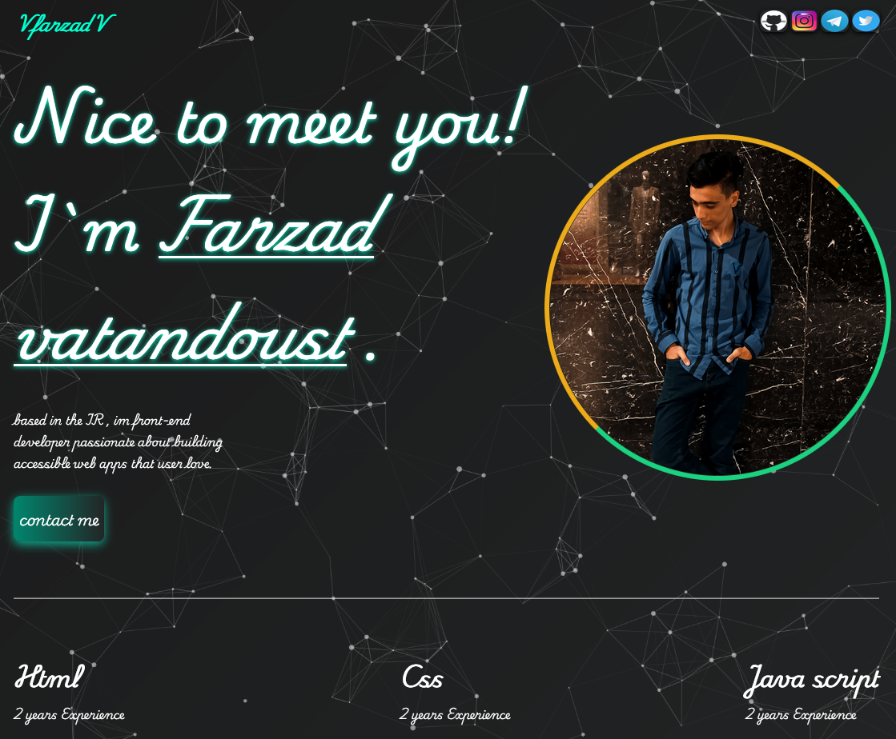

# 🌐 Personal Website

یک **سایت شخصی تک‌صفحه‌ای (Single Page)** که با **HTML و CSS ساده** ساخته شده و روی **GitHub Pages** منتشر شده است.  
این پروژه برای معرفی شخصی، نمایش مهارت‌ها و نمونه‌کارها طراحی شده و کاملاً **Responsive** است.

🔗 **Live Demo:**  
https://vfarzadv.github.io/training-personal-site/

---

## 🚀 Features

- 🧱 ساخته شده با **HTML5**
- 🎨 استایل‌دهی با **CSS3**
- 📄 طراحی **Single Page**
- 📱 کاملاً **Responsive**
- 🌍 منتشر شده با **GitHub Pages**
- ⚡ سبک، سریع و بدون Backend

---

## 🧩 Sections

این سایت شامل بخش‌های زیر است:

- 👤 **About Me** – معرفی کوتاه
- 💻 **Skills** – مهارت‌های فنی
- 🗂 **Projects** – نمایش پروژه‌ها
- 📬 **Contact** – راه‌های ارتباطی

---

## 🎨 UI Preview

<p align="center">
  
</p>


---

## 🛠️ Tech Stack

- **HTML5**
- **CSS3**
- **javascript**
- **particle.js**
- **GitHub Pages**
  
---

## 📦 Installation

برای اجرای پروژه به‌صورت محلی:

```bash
git clone https://github.com/VfarzadV/training-personal-site
cd training-personal-site
```


سپس فایل index.html را در مرورگر باز کن. 

## Project Structure

index.html
style.css

---

📄 License

This project is licensed under the MIT License
